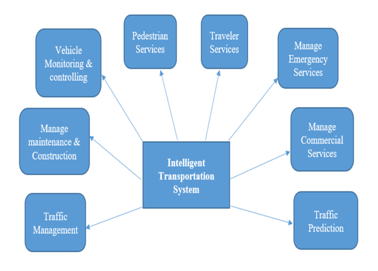
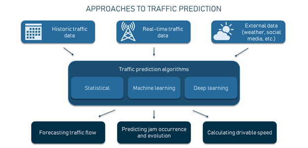
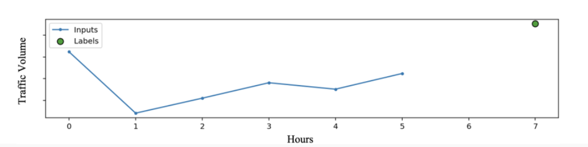
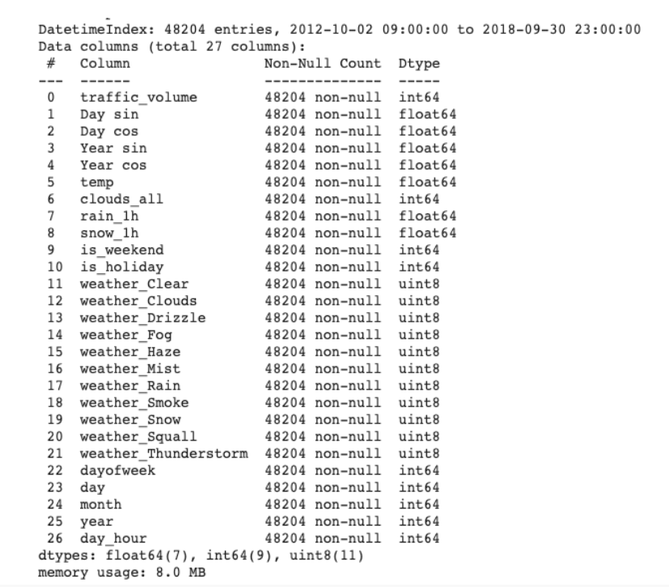
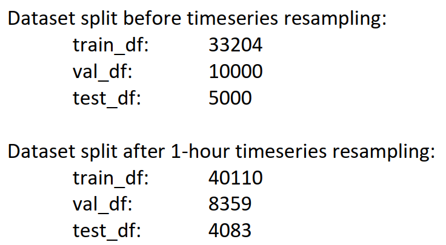
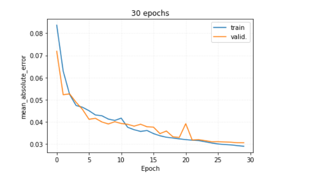
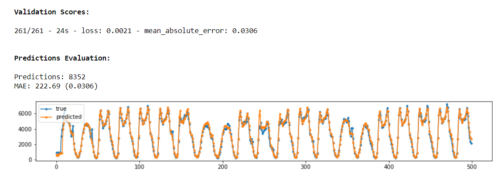

<h1 align="center">
  Traffic flow prediction using LSTM!
</h1>
 

## Introduction  

Traffic Flow Prediction (TFP) is a key aspect of Intelligent Transportation Systems (ITS), essential for predicting traffic patterns and optimizing traffic management [1]. As urbanization accelerates worldwide, cities face increasingly complex challenges such as traffic congestion, delays, and environmental degradation.  

Many countries have adopted ITS solutions to address these issues and reduce the economic burden of congestion. ITS uses advanced traffic management technologies, including data communication, information processing, and predictive analytics, to improve transport efficiency and safety [2]. TFP is a cornerstone of ITS, enabling critical functions such as speed regulation, travel time estimation, and congestion management.  

  

  
                                         
 <b>Figure 1. ITS</b> 
                 

Recent advances in smart city initiatives have led to an increase in the availability of traffic data, facilitating the development of data-driven predictive models. These models significantly improve transport networks by reducing travel times, increasing productivity, and minimizing the environmental impact of vehicles. Among these approaches, deep learning (DL) techniques, in particular long short-term memory (LSTM) networks, have attracted considerable attention due to their ability to process sequential data and outperform traditional machine learning (ML) methods in terms of accuracy and efficiency [3].  

Unlike traditional ML models, which often require extensive data pre-processing and feature engineering, DL methods such as LSTMs simplify these steps and excel at identifying meaningful patterns from large datasets. This advantage has made DL methods particularly suitable for TFP, especially as the availability of real-time traffic data continues to grow exponentially.  

Driven by these advances, this report focuses on applying LSTM networks, a class of Recurrent Neural Networks (RNNs) designed to model sequential data and capture long-term dependencies, to traffic flow prediction. Specifically, the report aims to forecast traffic volumes between Minneapolis and St. Paul, Minnesota, by predicting traffic conditions two hours into the future based on a six-hour window of historical data.  

## Problem Statement

Traffic congestion remains a significant global problem, resulting in longer travel times, increased air pollution, economic losses, and safety risks [4-6].
Traditional methods of alleviating congestion, such as expanding road infrastructure, are often unable to cope with the increasing complexity of traffic demands.  Similarly, traditional navigation systems, while helpful for real-time guidance, struggle to accurately predict future traffic conditions, particularly in areas with sparse data or unreliable connectivity.

To effectively mitigate congestion, modern solutions require advanced predictive modeling techniques that integrate historical and real-time traffic data to predict traffic patterns and optimize traffic flow. Among these approaches, Long Short-Term Memory (LSTM) networks have proven to be particularly effective in modeling sequential traffic behavior and capturing temporal dependencies within the data.

This study focuses on developing an LSTM-based predictive model that uses historical traffic data to predict traffic flow two hours into the future. By providing accurate and scalable predictions, the proposed model offers a proactive solution to improve traffic management and reduce congestion.

## Data Types, Sources, and Parameters for Traffic Flow Prediction (TFP)
Traffic is influenced by many factors that need to be taken into account for accurate forecasts. The main types of data required are listed below:

### Mapping data
A detailed map of the road network with associated attributes is essential. Connecting to global map data providers such as Google Maps, TomTom, HERE or OSM ensures access to complete and up-to-date information.

### Traffic Information
Both historical and current traffic-related data such as vehicle count, speed and type (trucks, light vehicles, etc.) are required. Devices such as loop detectors, cameras, weighbridges and radars collect this data. Alternatively, information can be obtained from providers such as Otonomo, which uses innovative vehicle-to-everything (V2X) technology to collect data from connected vehicles. Additional details on incidents (road closures, road works), points of interest and more can also be obtained from these providers.

### Weather information
Weather data (historical, current and forecast) is critical as meteorological conditions affect road conditions and driving speeds. Providers such as OpenWeather and Tomorrow.io offer reliable weather data.

### Additional road condition data
External sources such as social media posts, local news and police scanners provide critical information that affects traffic.

### Multi-Parameter Prediction Approach
TFP uses a multi-parameter approach that incorporates different traffic patterns:
- Flow: The number of vehicles passing through a given point in a given time.
- Speed: Distance travelled per unit time.
- Day: Days of the week (Sunday to Saturday).
- Day type: Categories such as holidays, weekends or working days.
- Clock Time: Hourly divisions (1-24 hours).
- Weather conditions: Factors such as sunny or rainy weather for training and forecast.

### Traffic Theory
Traffic flow and density are key variables, along with the concept of free flow:

- Traffic flow (q): Number of vehicles per unit time at a reference point.
- Traffic density (k): Number of vehicles per unit length of road. The critical density occurs when the road reaches a peak flow, beyond which the flow decreases and congestion occurs.
- Free flow: When the density is below the critical level, traffic is in a free flow state. Traffic flow can be expressed as "flow = speed × density".

## Literature Review
The literature review for TFP and ITS is based on articles, books, and research reports. The data collected will be analyzed to identify significant areas of concern.

TFP is primarily concerned with predicting short-term congestion using historical data. Several studies also incorporate real-time data to improve accuracy. Artificial intelligence (AI) techniques, particularly machine learning (ML) and deep learning (DL) models have shown great promise in improving TFP performance.

Recent studies highlight the use of Graph Neural Networks (GNNs) and other AI models, such as Convolutional Neural Networks (CNNs), for traffic forecasting. For example, Google Maps combines real-time and historical traffic data to reliably predict future traffic patterns.

---

## P.S. (Paid task) 
If you need the rest of the documentation or the complete paper, please feel free to email me at [thenomaniqbal@gmail.com](mailto:thenomaniqbal@gmail.com).  

This project is part of my GitHub directory. Contributions and feedback are always welcome!

---
## 
 
