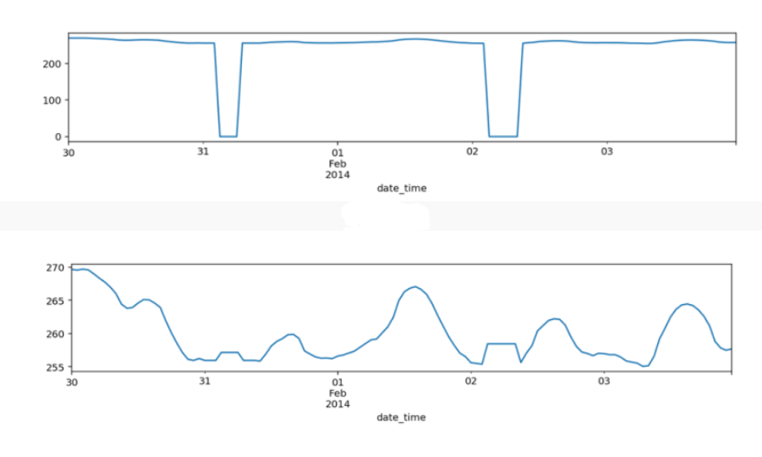

<h1 align="center">
  Traffic flow prediction using LSTM!
</h1>
 

 Traffic flow prediction (TFP) means predicting the volume and density of traffic flow, usually to control vehicle movement, reduce traffic jams, and create the optimal (least-time or energy-consuming) route. With the recent advancement in Artificial intelligence, Machine learning (ML), Deep learning (DL), and Big data, research in the field of predicting traffic flow has been expanded extensively.

 TFP is the key component of Intelligent Transport Systems (ITS) and can assist ITS to forecast traffic flow. Large cities have exceedingly difficult traffic regulations. many countries have adopted ITS to reduce the costs associated with traffic congestion. This study reviews the application of artificial neural network (ANN), ML, DL and other techniques and models for TFP. Finally, we will propose our own predictive model using DL, train and test it, analyze the accuracy and compare the accuracy of our model with other models.

 Comparing with conventional ML methods, DL models have the advantages such as simplifying data preprocessing procedures and outperforming other ML methods in terms of accuracy. Therefore, data-driven traffic flow prediction due to the availability of massive traffic data and DL schemes due to data preprocess procedures have received extensive attention recently in TFP.

 Furthermore, In recent years there has been a vast increase in available data with the advancement of smart cities. This modernization can have a favorable impact on transportation networks in the area of ITS, reducing travel times, boosting productivity, and minimizing the environmental impact of vehicles. ML and DL technologies are fast-growing domains for predicting traffic flow. Traffic signals, accidents, weather conditions, and road repairs are the primary causes of traffic. Since real-time traffic data are largely produced exponentially, big data principles must be used to improve data transportation. This fact motivated us to to predict the volume of traffic flow between Minneapolis and St. Paul at a specific point in Minnesota. Our aim is to build a multi-step Recurrent Nural Network (RNN) with Long Short Term Memory (LSTM) model that makes a single prediction point of the traffic volume 2 hours into the future, given the previous 6-hour window.

## 

 <a href="https://github.com/thenomaniqbal/Traffic-flow-prediction/">
     
     
      
     
      
     
     
     
      
     
  </a>
